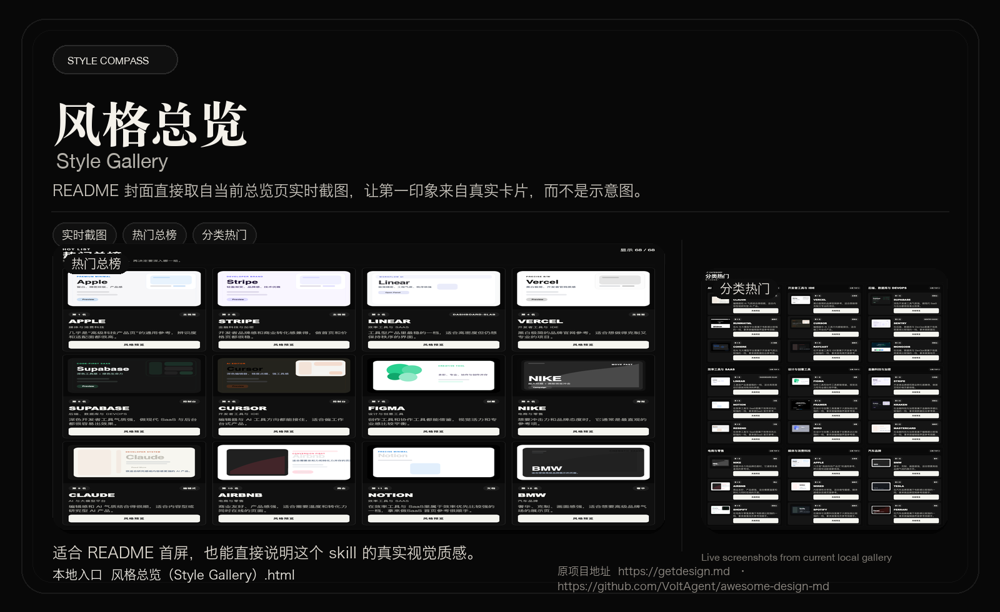
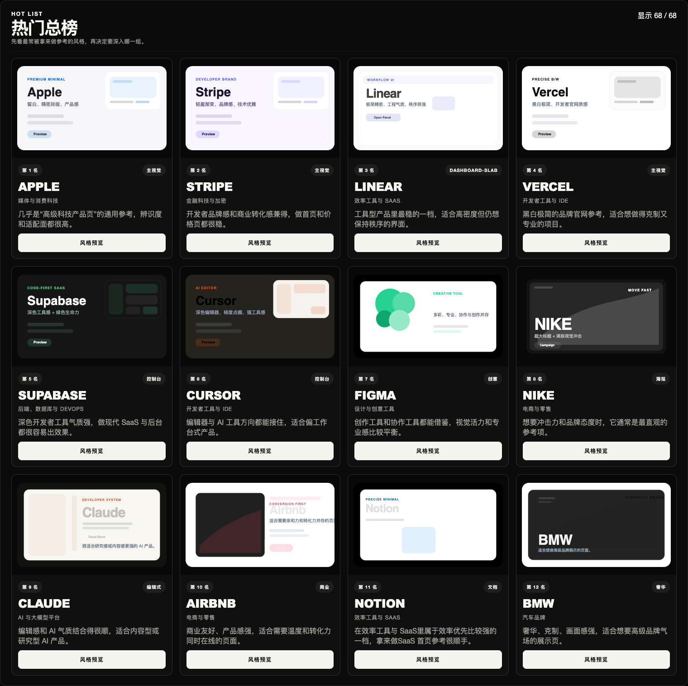
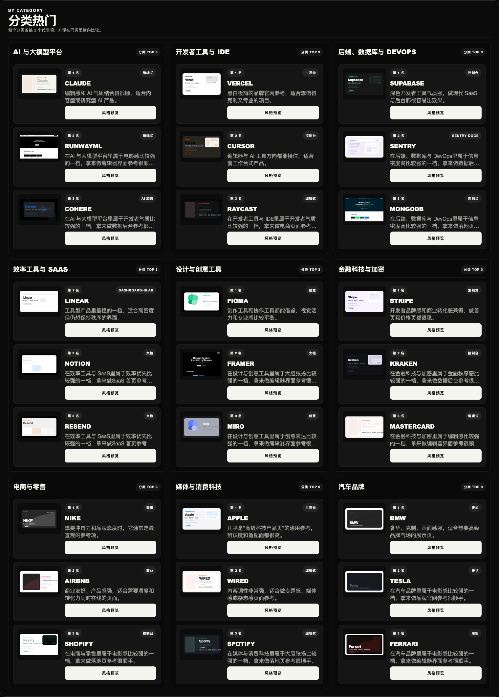

# English · [中文](README.md)

# Style Compass

Browse the gallery first, then let Style Compass recommend three stronger UI directions for your project and continue into a handoff-ready design draft.

**Open the gallery first:** [Style Gallery](风格总览（Style Gallery）.html)  
**Read the skill spec:** [SKILL.md](SKILL.md)

**Original project site:** [getdesign.md](https://getdesign.md)  
**Upstream repository:** [VoltAgent/awesome-design-md](https://github.com/VoltAgent/awesome-design-md)

Style Compass turns “help me choose a UI style” into a workflow you can browse, compare, and hand off. It helps you inspect directions first, then recommends three stronger candidates based on project type, screenshots, repository clues, or redesign constraints, and can continue into `DESIGN.md` or `UI-REFACTOR.md`.

This repository builds on `getdesign.md / awesome-design-md` and adds a local gallery, Chinese-first entrypoints, thumbnail audits, and a recommendation workflow for Codex.

## Start With The Gallery

If this is your first time using the skill, or you only know that you want something “more premium,” “more Apple,” or “more Linear,” the gallery is the fastest way to establish direction.

- Local entry: open `风格总览（Style Gallery）.html`
- Folder entry: open `风格总览（Style Gallery）/`
- Online hosting: publish `assets/gallery/style-gallery.html` via GitHub Pages, Vercel, or any static host
- GitHub preview: use the hero screenshot first, then open the full page locally when needed

## What You Get

- 68 styles to browse side by side
- Global hot list and category hot lists
- Chinese-first browsing with an English toggle
- Search, category, and layout filters
- Direct links to official preview pages
- Follow-up drafts for `DESIGN.md` or `UI-REFACTOR.md`

## Showcase

### 1. GitHub Hero Preview

This image is for the top of the README, repo overview, and social sharing. The hero now uses live screenshots from the current gallery instead of older placeholder artwork.

### 2. Live Hot List

This screenshot comes directly from the current hot-list section of the gallery. The first row should match the local browsing experience.

### 3. Live Category Favorites

This screenshot shows that the gallery is not just one ranking. It also supports horizontal comparison inside each style cluster.

## Suggested First-Time Flow

1. Open the gallery and skim the hot list plus category favorites.
2. Narrow the field to one to three candidates.
3. Run Style Compass for a structured recommendation.
4. Continue into `DESIGN.md` or `UI-REFACTOR.md` for handoff.

## Repo Entrypoints

- Gallery entry: [`风格总览（Style Gallery）.html`](风格总览（Style Gallery）.html)
- Gallery folder: [`风格总览（Style Gallery）/`](风格总览（Style Gallery）/)
- Built gallery page: [`assets/gallery/style-gallery.html`](assets/gallery/style-gallery.html)
- Skill spec: [`SKILL.md`](SKILL.md)
