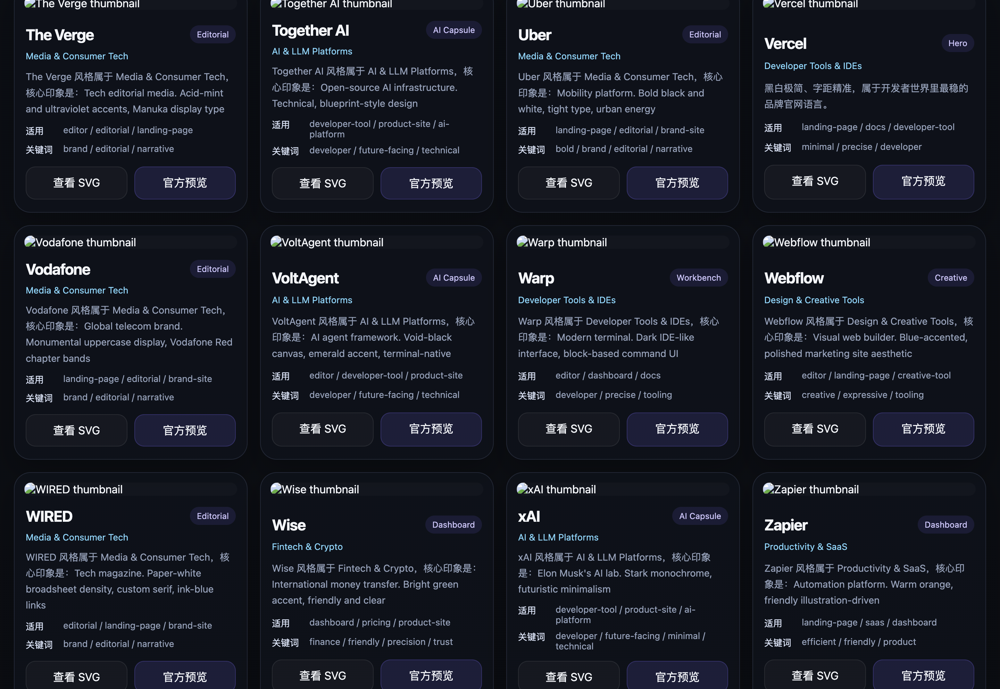
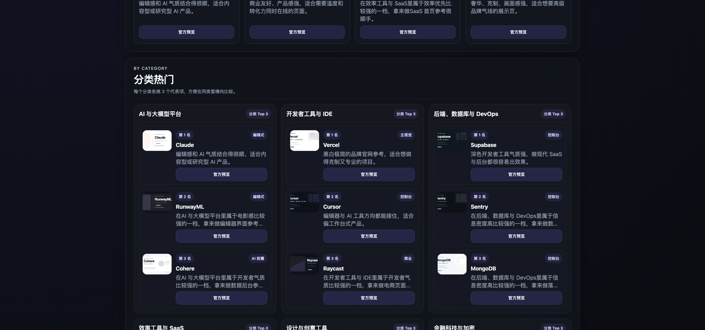

# 风格罗盘（style-compass）

先看风格总览，再做 UI 风格决策。


**Open the gallery first:** [风格总览 / Style Gallery](assets/gallery/style-gallery.html)  
**Then read the skill spec:** [SKILL.md](SKILL.md)

这是一个把“帮我挑风格”变成可浏览、可比较、可交接流程的 skill。它不是只给一句主观建议，而是先让你看总览、收敛方向，再给 3 个更合适的候选风格，最后继续生成 `DESIGN.md` 或 `UI-REFACTOR.md` 草稿。

## 先看总览

如果你是第一次接触这个 skill，或者你现在只知道“想要更高级一点 / 更像 Apple 一点 / 更像 Linear 一点”，先打开总览页最省时间。

- 本地打开：直接打开 `assets/gallery/style-gallery.html`
- 在线发布：将 `assets/gallery/style-gallery.html` 托管到 GitHub Pages、Vercel 或任意静态托管，即可得到在线入口
- GitHub 内预览：先看上面的 hero 截图，再决定要不要本地打开完整交互页

## What You Get

- 68 个风格可横向浏览
- 热门总榜与分类热门榜
- 中文默认浏览，并可一键切换 English
- 搜索、分类、布局筛选
- 每张卡可直达官方预览页
- 风格选定后可继续生成 `DESIGN.md` 或 `UI-REFACTOR.md`

## Showcase

### 1. GitHub Hero / 分享预览


这张图适合放 README 首屏、仓库介绍页和后续社交分享物料。

### 2. 卡片密度与信息结构



这一张更适合说明“这个 skill 不是只有一句推荐”，而是有成体系的卡片信息和官方预览跳转。

### 3. 总览组织能力



这一张适合强调总览页本身是一个可浏览入口，而不是脚本附带页面。

## Live Preview Setup

- 本地体验：直接打开 `assets/gallery/style-gallery.html`
- GitHub Pages：把 `assets/gallery/style-gallery.html` 作为静态页发布
- Vercel：把 `assets/gallery/` 目录当静态站点托管

如果你后面补上真实在线链接，建议把它直接放到 README 顶部 CTA 下方。

## Recommended First-Time Flow

1. 先打开“风格总览 / Style Gallery”，快速逛热门总榜和分类热门。
2. 从总览里收敛出 1 到 3 个候选风格，再让风格罗盘（style-compass）正式推荐。
3. 选定风格后，继续生成 `DESIGN.md` 或 `UI-REFACTOR.md`，再交给实现型 skill 落地。

## 适合谁先用

- 还没定 UI 风格，想先横向看方向的人
- 在 Apple / Stripe / Linear / Nike / Vercel 等风格之间犹豫的人
- 已有项目想升级 UI，但不想直接跳进实现的人
- 希望先定方向，再把结果交接给前端实现的人

## Core Outputs

- 3 张风格卡：最推荐、次推荐、对照项
- 风格适配理由、风险提示、官方预览链接
- `DESIGN.md` 初稿
- `UI-REFACTOR.md` 初稿
- 结构化 handoff prompt

## Repo Entrypoints

- 总览页：[`assets/gallery/style-gallery.html`](assets/gallery/style-gallery.html)
- Skill 规范：[`SKILL.md`](SKILL.md)
- 总览页构建脚本：[`scripts/build_style_gallery.py`](scripts/build_style_gallery.py)
- GitHub 预览图生成脚本：[`scripts/build_github_preview.py`](scripts/build_github_preview.py)

## Pre-release Red Team

开源前的极限红队测试资产已经放进仓库：

- 用例集：[`evals/evals.json`](evals/evals.json)
- 评审清单：[`evals/red-team-checklist.md`](evals/red-team-checklist.md)
- 工作区脚手架：[`scripts/scaffold_red_team_workspace.py`](scripts/scaffold_red_team_workspace.py)

生成第一轮工作区：

```bash
python3 scripts/scaffold_red_team_workspace.py --iteration iteration-1
```
